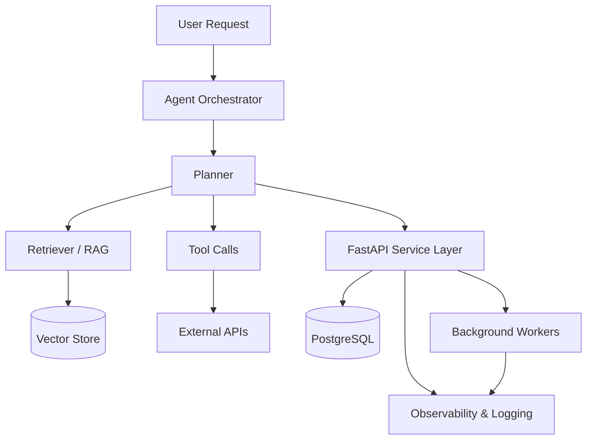
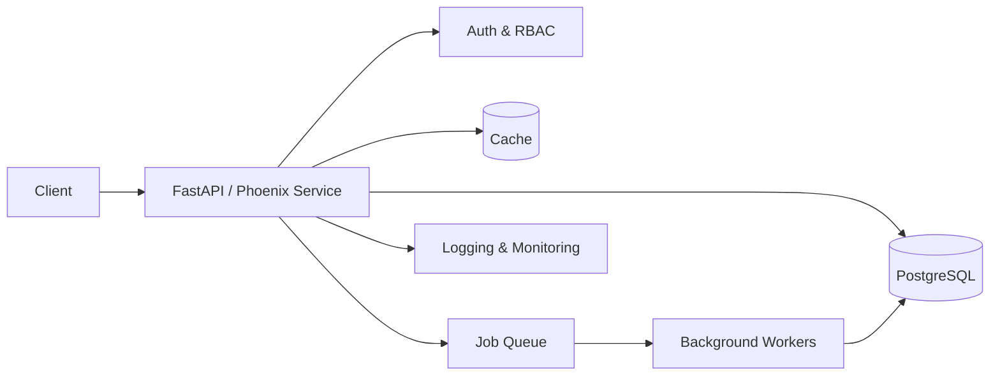
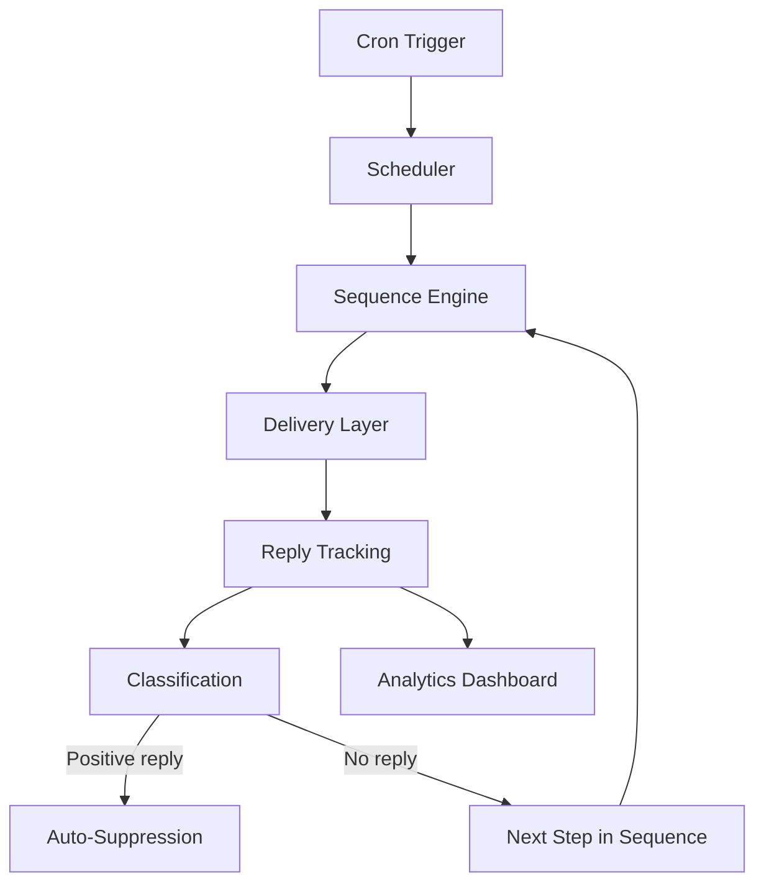
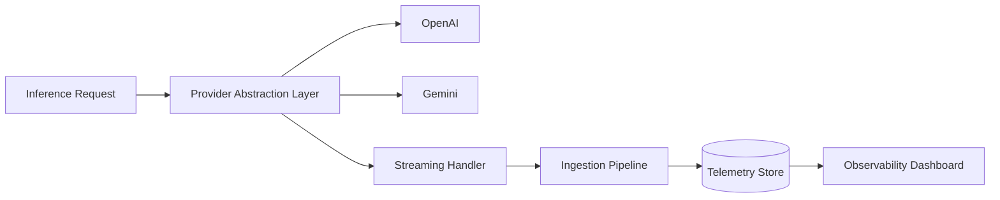

<div align="center">

<br/>


<br/>

# Habin Rahman

**Backend & AI Systems Engineer** transitioning deep into **Agentic AI** — I build production backend platforms and I'm now applying that same reliability discipline to autonomous, tool-using LLM systems.

<br/>

<a href="https://habin-portfolio.vercel.app"></a>
<a href="https://linkedin.com/in/habinrahman"></a>
<a href="mailto:habin936@gmail.com"></a>
<a href="https://github.com/habinrahman"></a>

<br/>


</div>

<br/>

<div align="center">


</div>

<br/>

---

## About

I design backend systems that stay correct under real operational load — enrollment engines, outreach automation, verification infrastructure — and I'm now pointing that same discipline at agentic AI: systems where an LLM doesn't just respond, it plans, calls tools, and carries state across steps.

I care about the boundary most AI demos skip past — the part where a system has to keep working after the happy path ends.

<br/>

## Philosophy

```
Reliability is a feature, not an afterthought.
Idempotency over optimism — every operation assumes it might run twice.
State transitions should be explicit — implicit state is where incidents live.
Automation should be observable, or it isn't trustworthy.
Simplicity scales. Unnecessary complexity doesn't.
```

<br/>

## Current Focus

I'm moving from LLM-integrated backend features toward true agentic systems — planning, tool orchestration, and multi-step autonomy, with the same production discipline I apply to backend infrastructure.

| Status | Area |
|---|---|
| 🟢 Production experience | LLM-integrated services, RAG, vector search, tool calling |
| 🟡 Actively learning | LangGraph, Model Context Protocol (MCP), multi-agent orchestration, AI evaluation |

I label these honestly on purpose — expertise claimed and expertise in progress are not the same thing.

<br/>

---

## Tech Stack

<table>
<tr>
<td valign="top" width="33%">

**Languages**

Python · TypeScript · Java · Elixir · SQL

</td>
<td valign="top" width="33%">

**Frontend**

Next.js · React · Tailwind CSS

</td>
<td valign="top" width="33%">

**Backend**

FastAPI · Phoenix · Spring Boot

</td>
</tr>
<tr>
<td valign="top">

**Databases**

PostgreSQL · Supabase · MySQL

</td>
<td valign="top">

**AI / LLM**

OpenAI · Gemini · RAG · Vector Search (pgvector) · LLM Tool Calling

</td>
<td valign="top">

**Cloud & Infra**

Docker · AWS · DigitalOcean · Kubernetes

</td>
</tr>
</table>

<br/>

---

## Architecture

How I structure the systems I build — an agent pipeline, a backend service, a workflow engine, and an inference layer.

<br/>

**Agentic AI Application**



<br/>

**Backend System**



<br/>

**Workflow / Automation Engine**



<br/>

**Inference / Observability Pipeline**



<br/>

---

## Featured Projects

<br/>

> **Pin these on your profile:** [AI-CSV-IMPORTER](https://github.com/habinrahman/AI-CSV-IMPORTER) · [RLS Inspector](https://github.com/habinrahman/rls-inspector) · [MyCareer-AI](https://github.com/habinrahman/MyCareer-AI)

<br/>

<table>
<tr><td colspan="2">

### 🎓 MicroDegree Hub
Student operations & cohort orchestration platform running live cohorts today.

**Architecture** — Next.js frontend → Supabase Auth/RBAC → PostgreSQL, with cron-driven batch jobs handling cohort lifecycle transitions across a multi-portal setup.
**Stack** — `Next.js` `TypeScript` `Supabase` `PostgreSQL`
**Key features** — enrollment lifecycle state machines · Zoom-integrated live sessions · role-based access control · audit logging · cron-driven orchestration

[Live](https://central.microdegree.work/) · [Repository](https://github.com/habinrahman/Hub)

</td></tr>
<tr><td colspan="2">

### 📣 Placement Outreach Automation
Campaign sequencing engine for high-volume, multi-touch outreach.

**Architecture** — Scheduler triggers a stateful sequence engine → delivery layer → reply tracking/classification loop, feeding an analytics dashboard. See the Workflow diagram above — this is the system it models.
**Stack** — `Python` `Workflow Orchestration` `Scheduler`
**Key features** — autonomous follow-up sequencing · reply intelligence with auto-suppression · fail-safe batch delivery · operational observability

[Live](https://outreach.microdegree.work/) · [Repository](https://github.com/habinrahman/microdegree-outreach-platform)

</td></tr>
<tr><td colspan="2">

### 📬 AI Job Application Tracker
Turns a Gmail inbox into structured application intelligence.

**Architecture** — Gmail API sync → LLM classification layer → Phoenix/LiveView backend → PostgreSQL, with monitoring on the classification pipeline itself.
**Stack** — `Elixir` `Phoenix` `PostgreSQL` `Gmail API`
**Key features** — inbox sync & classification · interview/rejection detection · reply-aware automation · analytics dashboard

[Repository](https://github.com/habinrahman/AI-Job-Application-Tracker)

</td></tr>
<tr><td colspan="2">

### 🧠 MyCareer AI
AI-powered resume intelligence & career mentorship platform.

**Architecture** — Next.js frontend → FastAPI backend → OpenAI for structured extraction/guidance, with retrieval over embedded resume + career data.
**Stack** — `FastAPI` `Next.js` `OpenAI`
**Key features** — resume parsing into structured signal · retrieval-augmented career guidance · LLM-orchestrated backend services

[Repository](https://github.com/habinrahman/MyCareer-AI)

</td></tr>
<tr><td colspan="2">

### 🔐 Certificate Verification Platform
Secure, scalable issuance & verification for digital certificates.

**Architecture** — FastAPI service → Supabase storage/DB → QR generation & hash/signature verification, deployed as a standalone cloud-hosted verification portal.
**Stack** — `FastAPI` `Python` `Supabase` `Docker`
**Key features** — QR-based verification · hash/signature integrity checks · per-template layouts · batch issuance for full cohorts

[Live](https://certificate.microdegree.in/) · [Repository](https://github.com/habinrahman/CertificationVerification-V2)

</td></tr>
<tr><td colspan="2">

### 📊 Ollive Inference Platform
Lightweight AI inference observability & telemetry platform.

**Architecture** — matches the Inference Pipeline diagram above: a provider-abstraction gateway in front of multiple model providers, feeding a streaming ingestion pipeline into telemetry storage and dashboards.
**Stack** — `Python` `Kubernetes` `Gemini`
**Key features** — streaming workloads · ingestion pipelines · provider abstraction · operational dashboards for inference behavior

[Repository](https://github.com/habinrahman/Ollive-Inference-Platform)

</td></tr>
</table>

<br/>

---

## Contribution Activity

<div align="center">


</div>

<br/>

---

## Open Source & Tools

Small tools built to solve a real problem, not to pad a portfolio.

| Project | What it does |
|---|---|
| [**AI CSV Importer**](https://github.com/habinrahman/AI-CSV-IMPORTER) | LLM-powered CSV importer mapping any lead CSV into a CRM schema — semantic field mapping, streaming parse, batched + retried AI calls, SSE progress, and a golden-set eval harness. |
| [**RLS Inspector**](https://github.com/habinrahman/rls-inspector) | Visual debugger for Supabase Row Level Security policies — catches missing `WITH CHECK` clauses and overly-permissive rules. |
| [**Competition Tracker**](https://github.com/habinrahman/competition-tracker) | Automated intelligence platform tracking EdTech, Cloud/DevOps, and GenAI updates with dedup and scheduled email digests. |

<br/>

---

## AI Journey

LLM integration → RAG & vector search → structured tool calling → **now: agentic orchestration.**

Each step above is backed by a shipped system, not a tutorial. The current step — LangGraph, MCP, multi-agent design, and evaluation — is genuinely in progress, and I'd rather say that plainly than round up.

<br/>

## Writing & Speaking

Not active yet. When there's something worth publishing about production agentic systems, it'll show up here instead of being implied.

<br/>

---

## Contact

<div align="center">

Open to roles and collaborations at the intersection of backend engineering and agentic AI.

<a href="https://habin-portfolio.vercel.app"></a>
<a href="https://linkedin.com/in/habinrahman"></a>
<a href="mailto:habin936@gmail.com"></a>

<br/><br/>

<sub>Design for scale. Build for reliability.</sub>

</div>
